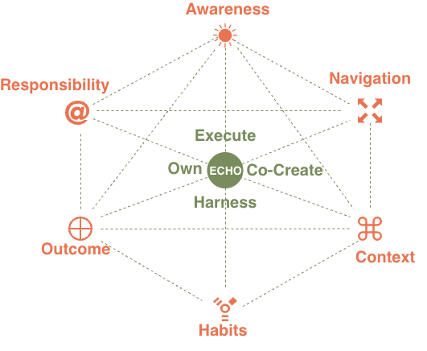

---
hide:
  - navigation
---
# Individual Fluency Model

## What is Individual Fluency?

Individual fluency is the measure of how effectively and responsibly a practitioner engages with AI in their daily work. It is not about how much AI someone uses, or how technically sophisticated their tooling is. It is about the quality of judgment, habit, and accountability they bring to every AI interaction — from a simple chatbot query to the orchestration of a multi-agent system  

<figure markdown="span">
  { width=500 }
  <figcaption></figcaption>
</figure>

Trustably's Individual Fluency Model operates across two dimensions. ANCHOR defines the six practice habits that every responsible AI practitioner should cultivate — the daily disciplines that determine whether AI use is purposeful, safe, and effective. ECHO defines the four modes of AI engagement — the types of work practitioners do with AI, each carrying its own distinct risks, responsibilities, and required habits.

ANCHOR habits are not a progression. They are concurrent disciplines, applied across all AI work at all times. ECHO modes are not a hierarchy. Experienced practitioners move fluidly across all four depending on the task. Together, ANCHOR and ECHO form the scoring surface of the Individual Fluency Model — each ANCHOR habit assessed across each ECHO mode, using CARE as the quality rubric.

---
### ANCHOR — The Six Practice Habits

> **Awareness**
>
> Awareness is the practice of honestly evaluating one's own AI fluency, the capabilities and limitations of the systems being used, and the fit between the task and the AI approach being taken.
>
> A practitioner with strong Awareness doesn't reach for AI by default — they ask whether AI is the right tool for this task, in this context, with this data. They understand what the model can and cannot do, where hallucinations are likely, and where human judgment is non-negotiable. Awareness is the foundation that makes every other ANCHOR habit possible: without an honest read of the situation, no amount of good habit or careful context-setting will produce trustworthy outcomes.
>
> *Assessed against CARE:* Strategic (purposeful use), Valid (fit-for-purpose application), Observable (knowing how to check system health).

---

> **Navigate**
>
> Navigate is the practice of making deliberate choices about when, how, and whether to collaborate with human and AI resource to maximise the impact.
>
> Navigation is about intentionality. A practitioner who Navigates well doesn't just use AI when it's convenient — they make a considered choice about the right combination of human and AI capability for each task, the right model or tool for the job, and the right level of autonomy to allow. They connect their AI use to organisational goals rather than personal convenience, and they know when to pause, escalate, or pull back from an AI-assisted approach entirely.
>
> *Assessed against CARE:* Strategic (outcome-based tool selection), Context-Aware (reading the situation before acting), Accountable (owning the navigation decision).

---

> **Context**
>
> Context is the practice of understanding the problem statement, stakeholder expectations, and data sensitivity of each specific use case.
>
> Context is what separates appropriate AI use from reckless AI use. A practitioner with strong Context discipline doesn't apply a generic prompt to a sensitive problem — they understand who is affected by the output, what data is involved, what the regulatory environment requires, and what the downstream consequences of errors could be. Context is not a one-time assessment at the start of a task; it is a continuous discipline that a practitioner revisits as the work evolves and conditions change.
>
> *Assessed against CARE:* Context-Aware (reads the situation), Valid (fit-for-purpose), Safe (knows when human override applies).

---

> **Habits**
>
> Habits are the disciplines — the repeatable, intentional routines that embed responsible AI use into daily work rather than treating it as an occasional consideration.
>
> Habits are what distinguish a practitioner who uses AI well occasionally from one who uses AI well consistently. Strong AI habits include things like always validating model outputs before acting on them, maintaining manual fallback skills for critical processes, regularly checking usage and cost dashboards, documenting the strategic intent behind AI-assisted deliverables, and intentionally "breaking" parts of a workflow to test how it degrades. Habits are not rules imposed from outside — they are practices a professional internalises because they understand why they matter.
>
> *Assessed against CARE:* Resilient (graceful degradation discipline), Viable (sustainable practice), Consistent (showing up the same way regardless of pressure).

---

> **Outcomes**
>
> Outcomes is the practice of measuring and reflecting on what AI-assisted work actually produced — assessing quality, accuracy, and true impact with adequate rigour.
>
> A practitioner focused on Outcomes doesn't accept AI output at face value. They measure whether the AI-assisted work actually achieved what it was meant to achieve — not just whether it was delivered quickly or looked convincing. This means comparing AI-assisted output to a non-AI baseline, checking for bias in results, evaluating whether the business objective was genuinely served, and being willing to surface cases where AI made the work worse, not better. Outcomes is the habit that closes the feedback loop and makes improvement possible.
>
> *Assessed against CARE:* Desirable (value over performance), Unbiased (checking outputs before acting), Explainable (articulating the AI's rationale), Transparent (open about AI's role).

---

> **Responsibility**
>
> Responsibility is the practice of owning the results — retaining human agency, exercising judgment, and maintaining accountability for outcomes regardless of how much of the work was AI-generated.
>
> Responsibility is the habit that no AI system can substitute for. A practitioner who embodies Responsibility understands that "the AI produced it" is never a sufficient explanation for a harmful, incorrect, or consequential output. They retain the right and the obligation to override, correct, or refuse AI outputs. They disclose AI involvement in their work. They escalate when something feels wrong even if they can't immediately articulate why. And they take full ownership of AI-assisted decisions in the same way they would take ownership of decisions made entirely by hand.
>
> *Assessed against CARE:* Accountable (takes responsibility for AI outcomes), Safe (applies human override), Transparent (open about AI's role in outcomes), Interoperable (collaborates responsibly across teams and tools).

---

### ECHO — Modes of AI Engagement

---

> ECHO modes are not a hierarchy — experienced practitioners move fluidly across all four depending on the task — but each mode carries a distinct set of responsibilities, risks, and required ANCHOR habits.

ECHO describes four modes of AI engagement that characterise how practitioners interact with AI systems across different types of work. Understanding your ECHO mode profile — which modes you work in most frequently, and how well your ANCHOR habits serve you in each — is the core of the Individual Fluency assessment.

---

> **Execute**
>
> Execute covers the deployment and operation of simple, well-scoped AI applications — chatbots, RAG pipelines, summarisation tools, and assistants where the AI performs defined tasks within clear boundaries.
>
> Execute work appears simple but carries real risk. The practitioner's primary responsibility is ensuring the system is doing what it claims to do — that the RAG pipeline is retrieving accurate information, that the chatbot is staying within its defined scope, that the summarisation tool isn't hallucinating key facts. The most critical ANCHOR habits at Execute are Awareness (is this system actually fit for this purpose?) and Outcomes (is it producing what we need?). The most common failure mode is treating Execute systems as "set and forget" — deploying them without ongoing validation and allowing errors to accumulate silently.
>
> *Primary CARE focus:* Valid · Observable · Safe

---

> **Co-create**
>
> Co-create covers iterative, research-intensive, and high-complexity multi-step AI workflows where the practitioner and AI are working together as genuine collaborators — designing solutions, exploring problem spaces, and building outputs that neither could produce alone.
>
> Co-create work demands the strongest Habits discipline of any ECHO mode. The iterative nature of co-creation — prompt, review, refine, repeat — creates conditions where errors accumulate across iterations and where the practitioner's judgment is the only consistent quality check. A practitioner working in Co-create mode needs to maintain genuine critical distance from AI outputs even as they become invested in the work, know when to reset rather than iterate further on a flawed direction, and be able to articulate the reasoning behind final outputs even when that reasoning emerged through a non-linear AI-assisted process.
>
> *Primary CARE focus:* Explainable · Integrated · Resilient · Accountable

---

> **Harness**
>
> Harness covers AI-assisted software development, single-agent deployments, and the use of tools and MCP integrations where the practitioner is actively directing AI capability toward specific technical goals.
>
> Harness work requires the strongest Context and Navigate disciplines. The practitioner is directing AI toward consequential technical outputs — code that will run in production, agent actions that will modify systems, tool integrations that will affect data and workflows. In Harness mode, the practitioner must understand not just what the AI is producing but what it is doing — the difference between AI that generates code and AI that executes actions is not just technical, it is a fundamental shift in risk profile. The most common failure mode is under-scoping agent permissions and over-trusting single-agent reliability.
>
> *Primary CARE focus:* Context-Aware · Secure · Valid · Observable

---

> **Own**
>
> Own covers the most sophisticated and consequential AI work — multi-agent orchestration, fine-tuning with RLHF, and the design of autonomous systems where the practitioner bears full accountability for system behaviour, safety boundaries, and downstream impact.
>
> Own is where every ANCHOR habit is tested simultaneously and where the stakes of failure are highest. A practitioner working in Own mode is not just using AI — they are designing systems that will use AI autonomously, make decisions, take actions, and potentially affect other people without a human in the loop for each step. The Responsibility habit is paramount: the practitioner must define safety boundaries, build in human override mechanisms, test degradation paths, and take full ownership of how the system behaves at the edges of its design. Fine-tuning with RLHF introduces an additional layer of accountability — the practitioner is shaping model behaviour in ways that will persist beyond any single interaction.
>
> *Primary CARE focus:* Safe · Accountable · Resilient · Context-Aware · Transparent

---

## The Fluency Matrix

The Individual Fluency assessment scores each of the six ANCHOR habits across each of the four ECHO modes. This produces a 24-cell matrix — not a single fluency score, but a capability profile that reveals where a practitioner's habits are strong, where they are underdeveloped, and which ECHO modes they are equipped to work in responsibly.

The image above shows an example of the content structure — each cell contains a named practice (such as "Failure-Mode Anticipation" for Resilient under Awareness, or "The FinOps Reflex" for Viable under Habits), a brief description of what that practice looks like in action, and the ECHO modes it is most relevant to. These named practices form the ANCHOR Playbook — the practitioner-facing equivalent of the institutional suggested actions, grounded in real AI engineering and responsible use research.

A practitioner who scores strongly on Awareness but weakly on Responsibility across Own mode is not "low fluency" — they are specifically underprepared for the accountability demands of multi-agent and autonomous system work. That precision is what makes the Individual Fluency Model useful: it produces a targeted development profile, not a single number. 

Since you are building a documentation site, breaking these into four separate tables (one for each CARE pillar) is the best way to ensure readability and allow users to navigate the "Socio-Technical" standards without being overwhelmed by one giant list.

Here are the curated Markdown tables for the **Individual Fluency Model**.

---

##### Consistent
*Ensuring that AI adoption is strategic, sustainable, and resilient regardless of pressure or circumstance.*

| Sub-Trait | ANCHOR Habit | Best Practice (Individual Action) | ECHO Tags |
| :--- | :--- | :--- | :--- |
| **Strategic** | Awareness | Value Hypothesis Alignment: Identifying the specific business objective an AI task serves before execution. | Execute, Co-Create |
| | Navigate | Outcome-Based Tool Selection: Choosing models based on strategic fit rather than ad-hoc convenience. | Co-Create, Harness |
| | Context | Strategic Opportunity Mapping: Identifying where AI can augment core professional value vs. busy work. | Harness |
| | Habits | The "Why" Journaling: Briefly documenting the strategic intent behind AI-assisted deliverables. | Harness, Own |
| | Outcomes | ROI Self-Assessment: Evaluating if AI saved time/improved quality relative to a non-AI baseline. | Own |
| | Responsibility | Strategic Stewardship: Reporting when an AI use case no longer aligns with organizational goals. | Own |
| **Viable** | Awareness | Resource Cost-Intuition: Estimating token/compute intensity of a complex chain before execution. | Execute |
| | Navigate | Prompt Efficiency Optimization: Refining prompts to reduce token bloat and inference costs. | Co-Create, Harness |
| | Context | Sustainable Stack Discipline: Avoiding fringe libraries that create long-term maintenance debt. | Harness |
| | Habits | The "FinOps" Reflex: Regularly checking usage dashboards to stay within allocated personal budgets. | Harness, Own |
| | Outcomes | Efficiency-Gain Metric: Measuring "Human-Hours Saved" vs. "AI-Resource Billed" for a workflow. | Harness |
| | Responsibility | Resource Stewardship: Raising the alarm if an automated system consumes more value than it creates. | Own |
| **Resilient** | Awareness | Failure-Mode Anticipation: Actively asking "What if the API/Model fails here?" during design. | Co-Create |
| | Navigate | Manual Fallback Fluency: Maintaining underlying manual skills to take over when AI systems fail. | Co-Create, Harness |
| | Context | State-Save Discipline: Saving checkpoints of AI work to prevent loss during context wipes or crashes. | Harness |
| | Habits | Graceful Degradation Testing: Intentionally "breaking" parts of a chain to test recovery paths. | Harness, Own |
| | Outcomes | Recovery Speed Mastery: Measuring success by how fast a "corrected state" is reached after failure. | Own |
| | Responsibility | Continuity Ownership: Ensuring deadlines are met regardless of AI "cooperation" or uptime. | Own |

---

##### Accurate
*Ensuring that decisions and judgements are grounded in evidence and a rigorous verification process.*

| Sub-Trait | ANCHOR Habit | Best Practice (Individual Action) | ECHO Tags |
| :--- | :--- | :--- | :--- |
| **Valid** | Awareness | Semantic Drift Detection: Noticing subtle shifts in model "logic style" that signal validation risk. | Execute, Co-Create |
| | Navigate | Differential Logic Testing: Running "Before/After" tests on prompt tweaks to verify logic stability. | Co-Create, Harness |
| | Context | Ground-Truth Curating: Selecting and formatting pure "Gold Standard" examples for RAG/Few-Shot. | Harness |
| | Habits | Regression Rituals: Running a "Golden Dataset" check after every modification to a system prompt. | Harness, Own |
| | Outcomes | Reasoning Variance Scoring: Manually grading the "Chain-of-Thought," not just the final answer. | Harness |
| | Responsibility | Fitness Sign-off: Formally owning the decision that a model is fit for its intended purpose. | Execute, Own |
| **Unbiased** | Awareness | Implicit Stereotype Spotting: Scanning outputs for linguistic archetypes or demographic assumptions. | Execute |
| | Navigate | Counter-Factual Prompting: Swapping demographic variables to check for tone or logic unfairness. | Co-Create, Harness |
| | Context | Representational Balancing: Intentionally adding diverse perspectives to the context window. | Harness |
| | Habits | Red-Teaming Self-Reflex: Attempting to coax biased responses from your own prompts before use. | Harness, Own |
| | Outcomes | Impact Disparity Audit: Reviewing output history for patterns of favoritism or exclusion. | Own |
| | Responsibility | Ethical Conscience: Refusing to deploy a model that shows persistent bias toward protected groups. | Own |
| **Explainable** | Awareness | Logic Gap Intuition: Spotting conclusions that lack a clear evidentiary path in the AI reasoning. | Execute, Co-Create |
| | Navigate | Rationale Extraction: Prompting models to externalize reasoning steps as standard documentation. | Co-Create, Harness |
| | Context | Citation Discipline: Insisting on direct source attribution and manually verifying every link. | Harness |
| | Habits | Versioned Rationalizing: Logging why prompts were changed relative to output shifts. | Harness, Own |
| | Outcomes | Interpretation Clarity: Grading outputs on whether a non-technical stakeholder can follow the logic. | Harness |
| | Responsibility | Audit Trail Stewardship: Taking personal responsibility for the "defensibility" of an AI action. | Own |
| **Integrated** | Awareness | Interface Boundary Sight: Identifying "accuracy leaks" at hand-off points between components. | Co-Create, Harness |
| | Navigate | Sequence Dependency Mapping: Documenting how upstream data changes ripple to final AI accuracy. | Harness |
| | Context | Schema Consistency: Ensuring JSON/variable names remain identical from prompt to tool-call. | Harness, Own |
| | Habits | End-to-End Walkthroughs: Testing full workflows manually, not just prompts in isolation. | Harness, Own |
| | Outcomes | Pipeline Cohesion Scoring: Evaluating the fidelity of info as it travels through AI/human stages. | Harness |
| | Responsibility | Holistic Ownership: Owning the final outcome even if the error occurred in a connected system. | Own |

---

##### Reliable
*Ensuring that AI use is visible, legible, and that the practitioner maintains full ownership of outcomes.*

| Sub-Trait | ANCHOR Habit | Best Practice (Individual Action) | ECHO Tags |
| :--- | :--- | :--- | :--- |
| **Observable** | Awareness | Signal-to-Noise Discernment: Noticing anomalous repetitive tokens or tone shifts before alerts trip. | Execute, Harness |
| | Navigate | Intentional Instrumentation: Adding checkpoint logs into prompts to make logic paths visible. | Harness |
| | Context | Drift & Decay Intuition: Identifying when a prompt loses effectiveness due to model/data updates. | Harness, Own |
| | Habits | Dashboard-Led Review: Starting sessions by checking telemetry logs for recent performance. | Harness, Own |
| | Outcomes | Root-Cause Analysis (RCA) Skill: Working backward from failure to prompt/retrieval/model source. | Harness |
| | Responsibility | Telemetry Stewardship: Ensuring your AI work is never a "Black Box" to the rest of the team. | Own |
| **Transparent** | Awareness | Disclosure Intuition: Identifying which stakeholders need to know a deliverable was AI-augmented. | Execute |
| | Navigate | Versioned Communication: Clearly stating model/prompt versions during peer reviews/delivery. | Co-Create, Harness |
| | Context | Methodology Openness: Sharing system instructions and meta-prompts rather than hiding them. | Harness |
| | Habits | Public Progress Logging: Documenting AI interactions in shared team spaces (Jira/Slack). | Harness, Own |
| | Outcomes | Communication Fidelity: Evaluating success by how well AI limitations were explained to users. | Execute |
| | Responsibility | Radical Honesty Ownership: Being the first to admit when AI results are uncertain or corrected. | Own |
| **Accountable** | Awareness | Agency Link Recognition: Realizing the human authorizer is the primary actor for all agent actions. | Execute, Own |
| | Navigate | Review & Refuse Habit: Stopping the line and rejecting unsafe AI outputs regardless of deadlines. | Co-Create, Harness |
| | Context | Identity-Linked Execution: Ensuring high-stakes AI actions are tied to a verifiable human identity. | Harness, Own |
| | Habits | Peer-Review Participation: Inviting others to audit prompts and logic with code-level rigor. | Harness, Own |
| | Outcomes | Error Attribution Skill: Articulating "I approved this because..." rather than "The AI said so." | Own |
| | Responsibility | Outcome Stewardship: Accepting personal responsibility for the AI’s effect on the business. | Own |
| **Interoperable** | Awareness | Format Compatibility Sight: Identifying potential "translation" errors between different model formats. | Co-Create, Harness |
| | Navigate | Composable Logic Design: Writing prompts that can be easily adapted or swapped across models. | Harness |
| | Context | Schema Standardization: Adopting industry-standard protocols (like MCP) for agent tool-calls. | Harness, Own |
| | Habits | Cross-Tool Integration Testing: Verifying AI outputs work seamlessly with non-AI software/APIs. | Harness, Own |
| | Outcomes | Ecosystem Success Rate: Measuring how well the AI integrates into the broader technical stack. | Harness |
| | Responsibility | Connectivity Advocacy: Pushing for open standards in AI tooling to prevent vendor lock-in. | Own |

---

##### Effective
*Achieving outcomes that deliver genuine value without compromising security or human safety.*

| Sub-Trait | ANCHOR Habit | Best Practice (Individual Action) | ECHO Tags |
| :--- | :--- | :--- | :--- |
| **Desirable** | Awareness | Value-to-Hype Discernment: Questioning if AI is the best tool or if a simple script is more effective. | Execute |
| | Navigate | Intent-Outcome Mapping: Defining a "Success Hypothesis" before starting any AI interaction. | Co-Create, Harness |
| | Context | Stakeholder Empathy Mapping: Ensuring the AI's "voice" aligns with the specific recipient's needs. | Harness |
| | Habits | Iterative Feedback Pull: Showing early AI drafts to humans to ensure direction is valuable. | Harness, Own |
| | Outcomes | Utility Scoring: Self-grading AI deliverables based on actual utility provided to the user. | Execute |
| | Responsibility | Value Stewardship: Refusing to deliver technically impressive but practically useless AI work. | Own |
| **Secure** | Awareness | Adversarial Mindset: Thinking like a "threat actor" to spot injection points in your prompts. | Execute, Co-Create, Harness, Own |
| | Navigate | Data-Boundary Setting: Strictly defining what data is sent to the model vs. redacted locally. | Co-Create, Harness |
| | Context | Vault & Secret Discipline: Never hard-coding keys; using environment variables for all AI secrets. | Harness |
| | Habits | Zero-Trust Interaction: Treating every model output as "untrusted" until scanned for risks. | Harness, Own |
| | Outcomes | Incident Prevention Baseline: Measuring success by the absence of PII leaks or security flags. | Own |
| | Responsibility | Security Gatekeeper Role: Denying usage of AI tools that don't meet corporate privacy standards. | Own |
| **Context-Aware** | Awareness | Risk-Tier Recognition: Identifying "High-Stakes" vs. "Low-Stakes" contexts before selecting tools. | Execute |
| | Navigate | Situational Tuning: Adjusting Temp/Top-P and tone based on the nuance of the specific task. | Co-Create, Harness |
| | Context | Dynamic Boundary Identification: Recognizing when an agent drifts out of scope and pulling it back. | Harness |
| | Habits | Purpose-Driven Exclusion: Removing irrelevant context that might confuse model intent/situation. | Harness, Own |
| | Outcomes | Contextual Fit Scoring: Grading success by how well the output fits industry-specific nuances. | Harness |
| | Responsibility | Guardrail Ownership: Defining exactly what the AI is not allowed to discuss in this context. | Own |
| **Safe** | Awareness | Harm-Potential Intuition: Scanning for toxic reasoning or advice that leads to psychological harm. | Execute, Co-Create, Harness, Own |
| | Navigate | HITL Agency: Building mandatory human "Review Gates" for any high-impact machine action. | Harness |
| | Context | Safety Override Discipline: Knowing how to "Kill" an autonomous process at the first sign of drift. | Harness, Own |
| | Habits | Red-Team Participation: Proactively trying to "break" your own safety filters to find gaps. | Own |
| | Outcomes | Reversibility Metric: Prioritizing AI actions that can be easily undone if an error occurs. | Own |
| | Responsibility | Kill-Switch Stewardship: The stance that you are the governor; if it isn't safe, it doesn't run. | Own |                                        |

