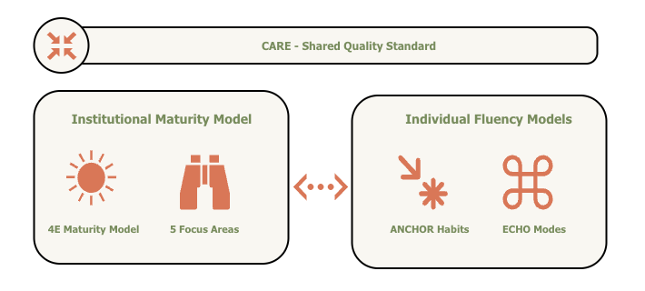

---
hide:
  - navigation
  - toc
--- 

## Why Trustably?

The AI governance landscape is crowded but poorly served. NIST AI RMF, Databricks DASF, and AWS Well-Architected AI Lens are rigorous and credible — but they were designed for enterprise organisations with the resources to interpret and implement them. Mid-size companies either attempt to apply frameworks that weren't built for their scale, or they proceed without governance entirely. Neither outcome is acceptable as AI moves from productivity tool to core business infrastructure.

The Problem: The Socio-Technical Gap
Most organizations approach AI adoption through a narrow lens: they either focus purely on **Technical Infrastructure** (buying the tools) or **Corporate Governance** (writing the policies). This creates a "Socio-Technical Gap" where an organization may possess a powerful AI platform but lack the individual practitioner fluency to use it safely, effectively, and accountably.

???+ trustably "The Solution"
    Trustably synthesises the best of these frameworks into something a 200-person company can actually use — grounded in the same technical rigour, but designed for self-service assessment, clear prioritisation, and short, actionable engagements rather than multi-month consulting programmes.

#### What Makes Trustably Different**

Three things distinguish Trustably from every other AI governance or maturity framework currently available.

- ##### **Unified**
    It is the **only** framework that simultaneously assesses organisational maturity and individual fluency — and measures both against the same quality standard. The gap between how mature an organisation's AI platform is and how fluent its people are in using it is one of the most common and least-diagnosed problems in enterprise AI adoption. Trustably makes that gap visible.
- ##### **Simple**
    It is built for mid-size organisations. The assessment is self-serve, the scoring is transparent, and the outputs are designed to be immediately actionable without requiring external interpretation. Short engagements — typically two to four weeks — convert assessment outputs into prioritised roadmaps that teams can execute themselves.
- ##### **Open**
    It is an open standard. The framework, the CARE rubric, the FOCUS areas, the 4E stages, and the ANCHOR habits are all publicly documented and freely available. Trustably is not a proprietary black box — it is a framework the community can use, critique, and improve.

{ align=right width="800" }
---

## **What is Trustably?**

Trustably is an Applied AI Adoption Framework designed to help organisations adopt AI in a structured, measurable, and responsible manner. Unlike existing frameworks built for large enterprises with dedicated compliance teams, Trustably is built for the reality of mid-size organisations — where the same person is often the architect, the risk manager, and the decision-maker, and where AI adoption is outpacing the governance structures meant to support it.

Trustably operates across two interlocking dimensions: how organisations build and govern AI systems, and how the individuals inside those organisations develop the habits and judgment to work with AI effectively. Most frameworks address one or the other. Trustably addresses both — and measures them against the same quality standard.

---

## **The Three Components**

Trustably is built on three distinct and interlocking components.

#### CARE Standard
  **CARE** is the shared quality standard that governs both models. It defines **15** sub-capabilities across four traits — **Consistent, Accurate, Reliable, and Effective** — each dual-defined with a system-facing interpretation for institutional assessment and a practitioner-facing interpretation for individual fluency assessment. 
  
???+ trustably "Not a Checklist"
     CARE is not a checklist. It is a rubric: a principled, consistent language for describing what good looks like at every level of the framework, applied the same way whether you are assessing a model registry or a practitioner's decision-making habits.

[Learn More](care.md){ .md-button }

### Institutional Maturity Model

- #### The 4E Maturity Spine
    *  **Explore:** Decentralized discovery and low-stakes prototyping.
    *  **Experiment:** Risk-mapped pilots and controlled testing environments.
    *  **Enable:** The standardized infrastructure, registries, and guardrails.
    *  **Embrace:** Full integration where AI is a core, self-governing business utility.
- ####  FOCUS Area
    These stages are assessed across five focus areas: 
    *   **Functional Governance**: The policies, risk frameworks, and accountability structures that ensure compliance. 
    *   **Observability**: The instrumentation and telemetry that make system behavior transparent and measurable.
    *   **Culture**: The organizational mindset and behavioral alignment required to sustain AI.
    *   **Unified Platform**: The standardized infrastructure and MLOps pipelines that enable scaling. 
    *   **Security**: The protections and guardrails that prevent data leakage and adversarial attacks.  

Each focus area contains sub-categories that persist across all four stages; what changes as an organisation matures is the depth and quality of practice within each one. The model is directly grounded in **NIST AI RMF, Databricks DASF, and AWS Well-Architected AI Lens**, giving every assessment cell external credibility and compliance traceability.

[Learn More](maturity.md){ .md-button }

### Individual Fluency Model
The **Individual Fluency Model** describes how practitioners develop the habits and judgment needed to work with AI responsibly and effectively.

- #### ANCHOR
    It operates across two dimensions: ANCHOR — six practice habits  that define what responsible AI practice looks like day to day
    *   **Awareness:** Recognizing AI risks, opportunities, and subtle shifts in system behavior.
    *   **Navigate:** Selecting the optimal models, tools, and paths to achieve the desired objective.
    *   **Context:** Grounding AI interactions in the specific situational, technical, and business reality.
    *   **Habits:** Embedding repeatable verification rituals and a "check-twice" mindset into the daily workflow.
    *   **Outcomes:** Prioritizing tangible business value and utility over purely technical performance.
    *   **Responsibility:** Taking full ownership of the results and ethical impacts of AI-assisted work.
- #### ECHO Modes
    Four modes of AI engagement that describe the nature and sophistication of how practitioners interact with AI systems:
    *   **Execute:** Transactional engagement focusing on simple applications, chatbots, and basic RAG implementations.
    *   **Co-create:** Iterative engagement focusing on collaborative research and high-complexity, multi-step AI workflows.
    *   **Harness:** Integrative engagement focusing on AI-assisted coding, single agents, MCP, and tool-chain integration.
    *   **Own:** Architectural engagement focusing on multi-agent orchestration, model fine-tuning, and RLHF.

ANCHOR habits are non-linear; they are concurrent disciplines applied across all AI work, not a ladder to climb. ECHO modes are the scoring surface that reveals where a practitioner's capability profile sits and where development effort is most needed.

[Learn More](fluency.md){ .md-button }

---

**How It Works**

An organisation using Trustably begins with the Playbook — a structured self-assessment that scores institutional maturity across the 4E × FOCUS matrix (20 scoring cells) and individual fluency across the ANCHOR × ECHO matrix (24 scoring cells). Each cell is assessed against CARE sub-capabilities, producing a maturity score, a risk profile, and a prioritised roadmap. The assessment is designed to be completed by multiple respondents across different roles — executive leaders, governance leads, technology leads, and practitioners — with each respondent answering the questions most relevant to their domain.

The output is not a compliance certificate. It is a practical diagnostic: where are you, where are the gaps, what should you do first, and how do you know when you've made progress.

[Explore Playbook](maturity.md#the-scoring-playbook){ .md-button }