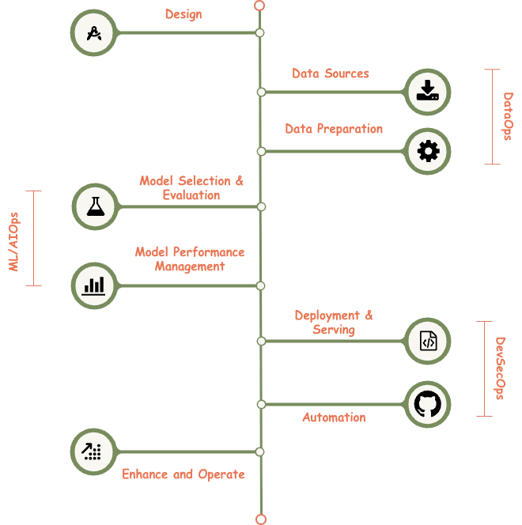

{ width="600" }

---

## The Operational Blueprint

The lifecycle is divided into five primary capability areas. Each area represents a set of governed processes and technical standards required to move a system from concept to production.

??? trustably "Design: The Foundation"
    The Design phase establishes the foundational intent, scope, and governance posture of the AI solution. This includes defining business objectives, value hypotheses, target users, decision boundaries, and ethical considerations. 

    Architectural principles, security-by-design requirements, data classification, and regulatory obligations are incorporated upfront to ensure compliance and traceability. Clear ownership, funding accountability, and success criteria are formalized to support downstream assurance activities.

??? trustably "DataOps: The Data Foundation"
    DataOps represents the governed, end-to-end management of data assets that underpin AI and analytics systems, encompassing both data sourcing and data preparation activities. It establishes standardized controls for data acquisition, validation, transformation, lineage, and stewardship to ensure data is trustworthy, compliant, and fit for purpose. 

    Operating as a cross-functional capability, DataOps enforces alignment with enterprise data governance, security, privacy, and regulatory requirements while enabling scalable and repeatable data pipelines.

    ??? quote inline "Data Sources"
        This section governs the identification, acquisition, and authorization of data inputs. Data sources are assessed for quality, provenance, sensitivity, licensing constraints, and regulatory compliance (e.g., privacy, data residency). Controls are established to ensure lawful access, appropriate consent, and alignment with enterprise data governance standards.

    ??? quote inline "Data Preparation"
        Data Preparation focuses on transforming raw data into model-ready datasets through cleansing, normalization, enrichment, and feature engineering. This stage enforces data integrity, bias mitigation, lineage documentation, and reproducibility controls. Governance oversight ensures that preprocessing decisions are transparent and auditable.

??? trustably "AI/MLOps: The Model Lifecycle"
    AI/MLOps is the enterprise capability responsible for the governed lifecycle management of AI and machine learning models. It establishes standardized processes and tooling to ensure models are developed, validated, operated, and evolved in a consistent, secure, and auditable manner. 

    By integrating monitoring, automation, and human-in-the-loop governance, AI/MLOps ensures models remain performant, reliable, and compliant throughout their operational lifespan.

    ??? quote inline "Model Selection & Evaluation"
        This section governs the selection of algorithms and architectures appropriate to the business and risk context. Models are evaluated against standardized criteria including accuracy, robustness, explainability, and fairness. Comparative testing and approval gates are applied to ensure defensible model choices.

    ??? quote inline "Model Performance Management"
        This ensures continuous oversight of model behavior. Performance metrics, drift indicators, bias signals, and reliability thresholds are monitored. Governance controls mandate periodic reviews and retraining triggers when performance deviates from approved tolerances.

??? trustably "DevSecOps: The Delivery Engine"
    DevSecOps embeds security, risk, and compliance controls across the build, deployment, and operation of AI services. It integrates secure engineering practices and automated control enforcement into development workflows, ensuring security is a shared responsibility rather than a downstream activity.

    By aligning with enterprise security architecture, DevSecOps enables resilient, compliant, and scalable delivery of AI systems while maintaining a measurable security posture.

    ??? quote inline "Deployment & Serving"
        This governs the controlled release of models into production. It includes infrastructure security, access control, version management, and integration with enterprise systems. Approval workflows ensure that only validated and authorized models are deployed, supported by runtime safeguards and observability.

    ??? quote inline "Automation"
        Automation addresses the orchestration of pipelines across ingestion, training, testing, and monitoring. Governance ensures automation is implemented with appropriate guardrails and human-in-the-loop controls. Change management and rollback procedures are embedded to maintain system stability.

??? trustably "Enhance and Operate: Steady State"
    This section represents the steady-state operation and continuous improvement of the AI system. It includes incident management, user feedback incorporation, cost optimization, and capability enhancement. 

    Governance mechanisms ensure changes are assessed for risk, approved through formal controls, and aligned with strategic objectives. This phase reinforces accountability for long-term value realization and responsible AI operation.