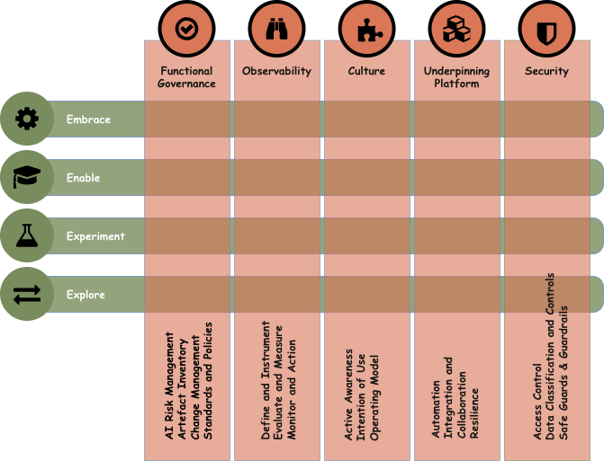
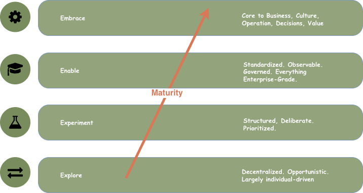
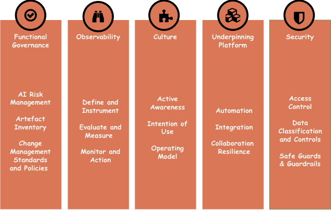

---
hide:
  - navigation
---
# Institutional Maturity Model

---

## What is the Institutional Maturity Model?

The Institutional Maturity Model is the organisational dimension of Trustably. It describes how organisations progress in their AI adoption journey — not as a linear march through identical stages, but as a multi-dimensional assessment across five distinct capability areas, each of which can be at a different maturity level at any given time.

<figure markdown="span">
  { width=600 }
  <figcaption></figcaption>
</figure>

The model is built on two interlocking structures: the 4E Maturity Spine, which defines four progressive stages of organisational AI adoption, and FOCUS, which defines five vertical pillars through which maturity is assessed and developed. Together they form a 20-cell scoring matrix — the primary output surface of the Trustably Playbook assessment.

The model is directly grounded in three leading AI governance frameworks: NIST AI Risk Management Framework (AI RMF), Databricks AI Security Framework (DASF), and AWS Well-Architected AI Lens. Every suggested action, rubric descriptor, and scoring question in the Institutional Maturity Model traces back to one or more of these sources, giving organisations both a practical assessment tool and a compliance mapping they can use with regulators, auditors, and boards.

---

## The 4E Maturity Spine 

The four stages of the 4E model describe qualitatively different states of AI adoption — not just "more" of the same capability, but fundamentally different operating modes. Each stage has a distinct character, a distinct risk profile, and a distinct set of organisational priorities.

<figure markdown="span">
  { width=600 }
  <figcaption></figcaption>
</figure>

> **Explore** is the beginning. AI adoption is decentralised, opportunistic, and largely individual-driven. Teams are experimenting with AI tools on their own initiative, with limited central oversight and no shared infrastructure or governance. The dominant risk at this stage is not that AI will fail — it is that AI will succeed quietly, embedding itself into workflows before anyone has assessed the implications. Explore organisations often don't know what AI is already being used across their teams, and the gap between what people are doing and what is officially sanctioned is wide.

---

> **Experiment** introduces structure. The organisation has identified priority use cases and is running deliberate, risk-mapped pilots in controlled environments. There is a growing awareness of governance requirements, and initial policies and accountability structures are being drafted. The dominant risk at this stage is that pilots succeed in isolation but fail to generalise — the organisation learns from its experiments but doesn't build the foundations needed to scale them. Experiment organisations often have strong pockets of AI capability and weak enterprise readiness.

---

> **Enable** is the platform stage — the hardest transition and the one where most organisations stall. At Enable, AI moves from project to platform: standardised infrastructure, model registries, MLOps pipelines, centralised governance, and enterprise-wide guardrails replace the ad-hoc tooling of earlier stages. The dominant risk at Enable is the operational complexity of standardisation — the organisation is simultaneously trying to scale what works, retire what doesn't, and govern everything in between. Enable requires the most deliberate investment of any stage because the decisions made here define the architecture the organisation will operate on for years.

---

> **Embrace** is the destination. AI is no longer a technology initiative — it is a core, self-governing business utility woven into how the organisation operates, makes decisions, and creates value. Governance at Embrace is proactive rather than reactive, platforms are self-optimising, and the culture has internalised responsible AI practice as a professional standard rather than a compliance requirement. The dominant risk at Embrace is complacency — organisations at this stage face the temptation to stop investing in governance because things appear to be working.

---

## FOCUS — The Five Institutional Pillars

FOCUS defines the five vertical pillars through which maturity is assessed across all four 4E stages. These pillars are not sequential priorities — they are parallel dimensions that every organisation must develop simultaneously, at different rates depending on context and risk exposure.

<figure markdown="span">
  { width=600 }
  <figcaption></figcaption>
</figure>

> **Functional Governance (F)** covers the policies, standards, risk management structures, accountability mechanisms, and artefact inventory practices that make AI adoption safe, compliant, and auditable. The emphasis on "Functional" is deliberate — governance that exists on paper but doesn't influence engineering decisions is not governance. At mature stages, Functional Governance means actively integrated guardrails that facilitate work rather than blocking it, with risk controls embedded into delivery pipelines rather than bolted on after the fact.

---

> **Observability (O)** covers the telemetry, instrumentation, monitoring, logging, and feedback loops that give organisations visibility into how their AI systems are actually behaving in production. This includes not just performance metrics but bias detection, drift monitoring, safety signal tracking, and the audit trails needed for accountability. At mature stages, Observability means that operational and optimisation decisions are triggered automatically by live monitoring data — the organisation is not waiting for problems to be reported, it is detecting them before users notice.

---

> **Culture (C)** covers the shared values, psychological safety, AI literacy, operating norms, and awareness practices that determine whether people in the organisation engage with AI thoughtfully and responsibly. Culture is the hardest FOCUS area to score because it is the most diffuse — but it is also the most consequential. An organisation with world-class platform infrastructure and a culture that treats governance as someone else's problem will fail at scale. At mature stages, Culture means AI-aware norms are self-sustaining: people proactively identify and surface risks, disclose AI involvement in their work, and hold each other to responsible practice standards without needing to be told.

---

> **Unified Platform (U)** covers the foundational technology stack — compute infrastructure, data pipelines, model registries, MLOps and DataOps tooling, integration patterns, automation capabilities, and resilience architecture. The word "Unified" is significant: the Platform pillar is not about individual tools but about the coherent, shared capability that makes AI delivery repeatable and scalable across the organisation. At mature stages, the Unified Platform is fully integrated into core engineering systems, supports agentic workloads with appropriate isolation, and self-optimises cost, performance, and resilience.

---

> **Security (S)** covers the defence-in-depth strategy protecting AI systems from data exposure, identity risks, adversarial attacks, prompt injection, model-specific vulnerabilities, and the unique attack surfaces introduced by LLMs and agentic systems. AI security is not a subset of general information security — it requires its own threat models, its own controls, and its own testing disciplines. At mature stages, security posture is continuously validated through automated testing, threat detection is integrated into AI operations, and controls adapt proactively as the threat landscape evolves.

---

## The Scoring Playbook

The 20 scoring cells are the primary output of the Trustably Playbook. Each cell sits at the intersection of a 4E stage and a FOCUS area, and contains three things: a milestone descriptor defining what that cell looks like when it is operating well, a CARE-grounded rubric defining what quality looks like at each maturity level within that cell, and a set of scoring questions that respondents answer to determine where the organisation currently sits.

Each cell is assessed on a 1–10 scale, mapped to four maturity bands: 1–2 represents Explore-level practice, 3–5 represents Experiment-level practice, 6–8 represents Enable-level practice, and 9–10 represents Embrace-level practice. This design means that a single score locates an organisation's practice within the 4E spine for that specific FOCUS area — making it possible for an organisation to be simultaneously at Enable for Functional Governance and at Experiment for Culture, which is a far more honest and useful picture than a single aggregate score.

The total question set spans approximately 175 questions across the five FOCUS areas, with between 30 and 40 questions per area. Questions are assigned to specific respondent roles — Executive/Head of AI, Risk/Governance Lead, Tech Lead/Architect, and Practitioner/Engineer — ensuring that assessment coverage reflects genuine organisational knowledge rather than a single stakeholder's perspective.
 