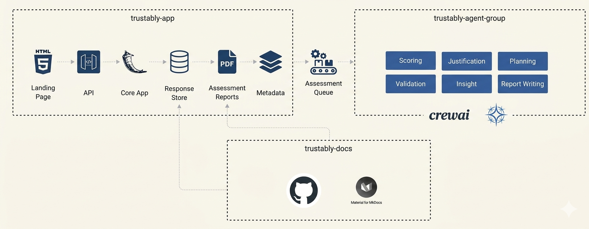

---
hide:
  - navigation
---

## The Scoring Model

The 20 scoring cells are the primary output of the Trustably Playbook. Each cell sits at the intersection of a 4E stage and a FOCUS area, and contains three things: a milestone descriptor defining what that cell looks like when it is operating well, a CARE-grounded rubric defining what quality looks like at each maturity level within that cell, and a set of scoring questions that respondents answer to determine where the organisation currently sits.

---

### How a Cell is Scored

Each cell is assessed on a 1–10 scale, mapped directly to the four 4E maturity bands:

| Score | Band | What it means |
|---|---|---|
| 1–2 | Explore | Ad hoc, undocumented, individual-dependent |
| 3–5 | Experiment | Emerging, pilot-scoped, inconsistently applied |
| 6–8 | Enable | Defined, standardised, consistently enforced |
| 9–10 | Embrace | Optimised, self-improving, proactively governed |

???+ trustably "Not a Golden Ticket"
    This design means a single score does two things simultaneously: it locates an organisation's practice on the 4E spine for that specific FOCUS area, and it describes the quality of that practice through the CARE rubric. 

A score of 6 in the `Observability × Culture` cell doesn't just mean that the organisation is at ``Enable`` for cultural awareness of observability" — it means your organisation shows up the same way on monitoring awareness (Consistent), grounds its observability decisions in evidence (Accurate), and its monitoring practices are dependable (Reliable) — but is not yet self-optimising or proactively governed (Effective at full depth).

---

### A Worked Example

> Consider a 300-person fintech company running a Trustably Playbook assessment. Their Tech Lead scores the Observability × Unified Platform cell at 7. Their Risk Lead scores the same cell at 4. Their Executive scores it at 8.
>
> This variance is itself diagnostic information — not a problem to be averaged away. The Tech Lead sees a well-instrumented platform because they built it. The Risk Lead sees incomplete coverage because they're trying to use the monitoring data for governance and finding gaps. The Executive sees strong tooling because that's what they've been told. The true score for that cell is not the average (6.3) — it is the starting point for a conversation about which view is accurate and why the three perspectives diverge.
> 
>Trustably surfaces this variance explicitly. Where respondent scores differ by more than 2 points within a single cell, the output flags a confidence gap — indicating that the organisation has a perception problem as well as a maturity problem. Resolving the perception gap is often the first action on the roadmap.

>Now consider what happens when all five FOCUS area scores are plotted for a single 4E stage — say, the Enable stage. The result looks like this for the same fintech:
>
>| FOCUS Area | Score | Band |
|---|---|---|
| Functional Governance | 7 | Enable |
| Observability | 6 | Enable |
| Culture | 4 | Experiment |
| Unified Platform | 7 | Enable |
| Security | 5 | Experiment |

> This organisation is broadly at Enable for technical capabilities (Governance, Observability, Platform) but lagging at Experiment for the human dimensions (Culture, Security). This is a classic pattern: technical investment outpacing the cultural and security practices needed to govern it responsibly. The roadmap priority is clear — not more platform investment, but closing the Culture and Security gap before the technical advantage creates ungoverned risk.

---

## Maturity Level Progression

???+ trustably "Critical Principle"
    Trustably's maturity progression is modelled on the the principle that organisations must consolidate practice at one level before attempting the next, and that skipping levels is not acceleration, it is debt accumulation.

The practical implication is that movement between bands is governed by threshold rules, not averages. An organisation does not graduate from Experiment to Enable because their average score crossed 6. They graduate when every sub-category within a FOCUS area has reached the minimum threshold for Enable-level practice. A single sub-category stuck at Experiment level — say, Change Management stuck at 4 while the other Governance sub-categories sit at 7 — anchors the entire Governance pillar at Experiment. The weakest sub-category sets the maturity level, not the strongest.

This threshold logic serves an important purpose: it prevents organisations from over-investing in areas where they are already strong while neglecting foundational gaps that will eventually surface as incidents. It is the difference between a governance programme that looks good on a scorecard and one that actually holds up when something goes wrong. To be assessed at Enable level for that FOCUS area, all three sub-categories must score 6 or above. If one scores 5, the FOCUS area sits at Experiment regardless of the others.  

---

**The Radar Chart**

The primary visual output of a Trustably Playbook assessment is a radar chart — one axis per FOCUS area, plotted on the 1–10 scale, producing a shape that immediately communicates both the overall maturity level and the balance across the five pillars.

A balanced, high-scoring pentagon signals an organisation that has developed all five capability areas proportionately — the ideal state. In practice, no organisation produces a perfect pentagon. The shapes that emerge are diagnostic in themselves:

A **forward-leaning shape** — strong on Unified Platform and Observability, weak on Culture and Governance — is the most common pattern. It describes an organisation where engineering investment has outrun the human and process infrastructure needed to govern it. The risk is that technical capability is operating without adequate oversight, and the first serious AI incident will expose governance gaps that should have been addressed earlier.

A **governance-heavy shape** — strong on Functional Governance and Culture, weak on Observability and Unified Platform — describes an organisation where policy has outrun capability. Rules exist but the tooling to enforce them doesn't. This is common in regulated industries where compliance pressure drives governance investment ahead of technical readiness.

A **flat, low shape** — uniformly low scores across all five areas — describes an Explore-stage organisation where AI adoption is genuinely early and foundational investment is needed across the board. The roadmap in this case is not about prioritisation but about sequencing — what must be built first to make everything else possible.

A **spiked shape** — one or two areas significantly higher than the others — usually indicates either a recent investment event (a new security platform, a new governance framework) or a measurement confidence problem (one FOCUS area was assessed by a single well-informed respondent while others were assessed by people with limited visibility).

The radar chart is always accompanied by the cell-level scores and the respondent variance analysis. The shape tells you what the situation is. The cell scores tell you where the gaps are. The variance analysis tells you how confident you should be in the picture. Together, they produce a complete diagnostic.

---

**From Score to Roadmap**

???+ trustably "Practical Activation"
    In practice, each FOCUS areas are mapped with CARE sub-capabilities with very specific suggested actions. 

The scoring output directly generates a prioritised roadmap through three mechanisms.

First, sub-categories below threshold are automatically identified as roadmap items, tagged to the FOCUS area and 4E stage they belong to, and mapped to the specific CARE sub-capabilities they need to develop.

Second, the threshold gap is calculated for each sub-category — the distance between the current score and the minimum score required to reach the next maturity band. Sub-categories with small gaps (scoring 5 when the Enable threshold is 6) are prioritised over sub-categories with large gaps (scoring 2 when the Enable threshold is 6), because quick wins that unlock CMMI-style level progression are more valuable than long-term investments that don't change the current maturity assessment.

Third, the suggested actions from the Trustably action library — over 200 actions mapped to FOCUS areas, sub-categories, and CARE sub-capabilities — are filtered to the specific cells and gaps identified in the assessment. The result is a roadmap that is not generic best practice advice but a targeted set of actions specific to the organisation's current position on the 4E spine.

The roadmap is structured across three horizons: immediate actions achievable within one to four weeks, short-term investments delivering value within one to three months, and strategic initiatives addressing longer-term maturity development. This horizon structure reflects the reality of mid-size organisations — they need quick wins that build momentum and demonstrate value alongside the longer-term foundational investments that will determine their AI maturity trajectory.

---

**The Total Question Set**

The full Playbook assessment spans approximately 175 questions across the five FOCUS areas, with between 30 and 40 questions per area. Questions are distributed across the 15 CARE sub-capabilities within each FOCUS area — approximately two to three questions per sub-capability per focus area — ensuring that every dimension of the CARE rubric is assessed with sufficient depth to produce reliable scores.

Questions are assigned to specific respondent roles — Executive/Head of AI, Risk/Governance Lead, Tech Lead/Architect, and Practitioner/Engineer — and no respondent is expected to answer all 175 questions. A typical respondent will answer between 40 and 60 questions relevant to their role and domain, with overlapping coverage on high-stakes cells ensuring that respondent variance is captured and flagged where it exists.

The recommended minimum for a reliable assessment is three respondents covering at least three of the four roles. A single-respondent assessment — like the Versent example discussed in the Trustably benchmark analysis — can still produce useful directional output but should be treated as indicative rather than definitive, particularly for FOCUS areas where the single respondent's role does not give them direct visibility of the practices being assessed.

[See All Question](images/questions.tsv){ .md-button }

## Trsutably Application Ecosystem

This ecosystem is designed to automate the transition from raw practitioner/institutional data into a structured **Trustably Assessment Report** using a multi-agent orchestration pattern.

---

<figure markdown="span">
  { width=800 }
  <figcaption></figcaption>
</figure>

#### trustably-app (The Core Engine)
This is the user-facing interface and orchestration layer, likely built with **Flask** or a similar Python web framework.

- **Landing Page (HTML5)**
    The entry point where users or consultants input assessment data. This serves as the capture mechanism for both the **4E Maturity** markers (Institutional) and **ANCHOR/ECHO** metrics (Individual).
- **API:** 
    A RESTful interface that decouples the frontend from the heavy-lifting logic. It receives payloads, validates them, and routes them to the Core App.
- **Core App:** 
    The "Brain" of the application. It handles user sessions, business logic, and prepares the data for the agentic analysis phase.
- **Response Store:** 
    A database (likely SQL-based or a structured JSON store) that persists raw assessment responses, ensuring data durability before processing.
- **Assessment Reports (PDF):** 
    The final output generator. Once the agents complete their analysis, this component compiles the results into a professional, board-ready PDF document.
- **Metadata:** 
    A dedicated layer for managing system configurations, scoring rubrics (the 15 CARE traits), and version-controlled framework definitions.
- **Assessment Queue**
    Located between the App and the Agents, this serves as the **Asynchronous Bridge**. Because agentic reasoning (LLM calls) can be time-consuming, the queue manages the flow of assessment jobs. It ensures that the web app remains responsive while the "Crew" works in the background to generate the analysis.

#### trustably-agent-group (The Intelligence)
This component leverages **CrewAI** to perform specialized cognitive tasks that a static algorithm cannot handle. Instead of just "calculating" a score, these agents provide **justification** and **strategic insight**.

- **Scoring Agent:** 
    Analyzes the raw input against the **90-cell ANCHOR/ECHO matrix** and the **4E Focus Areas** to generate quantitative metrics.
- **Justification Agent:** 
    Its primary role is to explain the "Why" behind a score, ensuring the report meets the **Explainable** trait of the CARE standard.
- **Planning Agent:** 
    Looks at the current Maturity stage and creates a prioritized roadmap (Now/Next/Later) to help the organization move up the 4E spine.
- **Validation Agent:** 
    Acts as an internal auditor, cross-referencing agent outputs against the **CARE** rubric to ensure consistency and accuracy.
- **Insight Agent:** 
    Performs systemic pattern recognition, identifying hidden risks or opportunities that span across multiple focus areas (e.g., how a specific Culture gap is impacting Security).
- **Report Writing Agent:** 
    Synthesizes the outputs of all other agents into a cohesive, persuasive narrative that forms the text of the final report.

#### trustably-docs (The Knowledge Base)
    

* **GitHub:** The repository for version-controlled documentation, including the **90 patterns** and the **CARE** rubric definitions. This is the "Source of Truth" for the framework's logic and patterns.
* **Material for MkDocs:** The engine that renders these technical specifications into the public-facing documentation site. It ensures that the assessment agents are always scoring against the latest, most "tightened" version of the framework.

---

